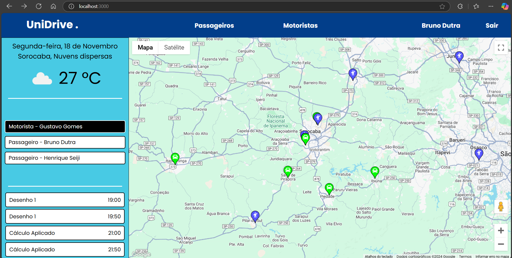
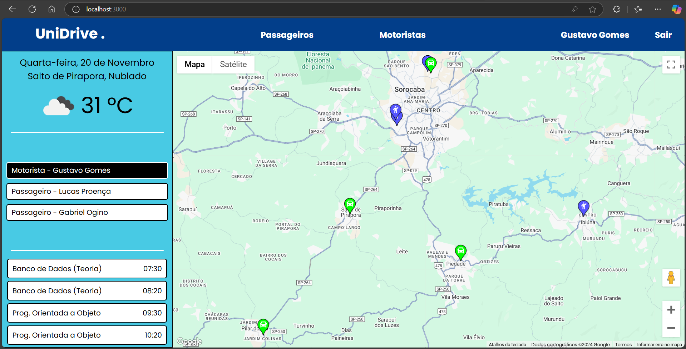
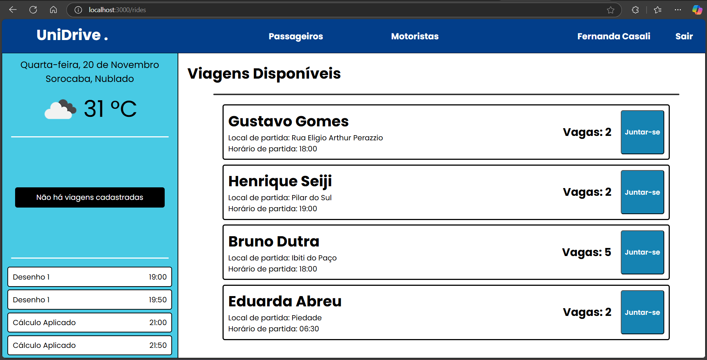
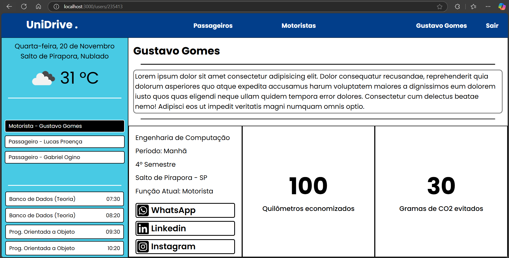

# UniDrive 🚗

This project is a prototype of a carpooling app developed for academic project. This system was created to help students organize and book rides to the college in a practical and sustainable way. 

---

## Project Description 👨‍💻

UniDrive is website developed with **Node.js** and **PostgreSQL** that allows students to:
- **Offer rides:** telling the trip details, such as time and local of departure.
- **Search rides:** fiding drivers who can take them to college.

The main motivation is to reduce the number of cars in circulation and contribute to the reduction of gas emissions, promoting a positive environmental impact. The destination of carpooling is always the college, allowing more integration between students.   

The project aims to align with two of the UN's Sustainable Development Goals: SDG11, which seeks to create sustainable cities and communities, and SDG13, which seeks actions to mitigate global climate change.

---

## Used Tech 🧪

- **Back-end:** Node.js (Express.js)  
- **Banco de Dados:** PostgreSQL  
- **Template Engine:** EJS

---

## Main Features 💻

1. **User Registration and Login:**  
   - Each user can register as a driver or passenger.  

2. Ride-Hailing System:  
   - Drivers can create ride-hailing offers.  
   - Passengers can pick up and request available rides.  

3. Simple and intuitive interface:  
   - Design with usability in mind, allowing the system to be easily used by any student.

---

## Improvements, New Features and Bugs 🛠️

1. **Improvements**
   - Make the interface more attractive and intuitive.
   - A request is made to the Open Weather API every time a page that requires weather data is loaded, it would be valid to re-check the number of requests for cases where the pertinent data has already been accessed, thus avoiding redundant requests.
   - Some students have classes both in the morning and at night, it would be valid to implement a logic that supports these cases.
   - The current logic (11/20/2024) does not validate the data entered during registration and this may compromise the operation of the program.
   - Improve the HTML and CSS implementation.
   - ...
     
2. **New Features**
   - Make the website responsive.
   - Create a way for the user to change the data entered during registration.
   - Create a way for the user to cancel the trip in which they are registered.
   - Create a way for the user to re-register their classes.
   - Create the possibility of registering for more than one trip.
     
3. **Bugs**
   - During the tests, it was common to have errors when trying to acquire data from the Open Weather API, but I believe that this is just a problem in communicating with the servers.
   - On the profile page, if the page is reloaded the site will "crash", I have not investigated the problem in depth but probably the cause is the obtaining of the profile data that is being viewed.
   - ...

---

## Try It Yourself 💁‍♂️

1. **Clone the repository**
```bash
git clone <repository-url>
```

2. **Install dependencies:**
```bash
npm install
```

3. **Create an .env file in the project root and configure the environment variables**
```bash
# Server port, if not specified, it will be port 3000
PORT=your_port

# DB Variables
DB_HOST="localhost"
DB_PORT=db_port (probably 5432)
DB_USER=your_user
DB_PASSWORD=your_password
DB_NAME=db_name

# Open Weather API Key
OPEN_WEATHER_KEY=your_key

# Google Maps API KEY
GOOGLE_MAPS_KEY=your_key
```

4. **Start Server**
```bash
node index.js
```

---

## Images 🎮

See below some images that show some features and pages of the site.









---

